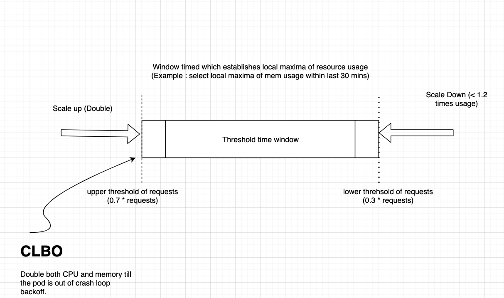

# Virtual Pod Autoscaler Recommender Rewrite

Crash loops due to spike in pod resource usage is an observed behaviour for targets autoscaled by vertical pod autoscaler.
This document proposes an alternate solution for resource recommendation by virtual pod autoscaler to handle spike usage.

## Problem
The current VPA recommender has the following problems which calls for enhancement in the recommending scheme for the VPA to try and auto-heal a component that go into crash loops due to spikes in resource usage.

1. Current VPA recommender implementation considers historic usage of resources by a pod for recommending scale of memory and CPU. This method is not efficient in handling spike in resources usage. When a spike occurs, the recommender lacks information about it in historic usage to bump up the resources and scale up. This can result in frequent component outages.
2. Stagnant CPU recommendations w.r.t increasing limits during scale up and decreasing them during scale down scenarios.
3. OOM Kills and possible livenessProbe failures due to inefficient CPU and memory recommendation. One observation is that in a component that is in crash loop, memory recommendation is increased much more than CPU recommendations especially if OOMKills occur. But many a times, OOMKills occur due to CPU being throttled and recommending only memory scale up in such cases is not efficient. The below recommendation given from a sample where 100 periodic iterations with 10s intervals, of increasing the CPU millicores consumptions by  shows clearly how the CPU recommendation has not scaled according the given requirement. It also shows how the memory is limits are increasing while CPU is remaining same for requests and limits.

```
Note: The experiment to simulate OOM Kill scenario was conducted using .
      The graphs below capture details of a container journey through constant CPU resource consumption. "consume-cpu" API from resouce-consumer was
      used for this experiment. It was bombarded against the service endpoint of the deployment for 100 times with 5 seconds interval between every iteration to generate a sustained high load.
```
We can see the pod restarting once it faces resource crunch at around 14:21 - 14:45 local time in the graph timeline.


4. For both CPU and memory the recommender suggests a percentile resource unit upgrade from the historical value of resource usage obtained from memory, VeriticalPodAutoScalerCheckpoint or Prometheus client. This does not take into account the current sudden bump in the resource which might be increasing rapidly (exponentially) over a short duration and might be outside any observed range captured in the history. VPA recommender does not suggest a better scale up and scale down for such spikes (it often recommends less than the current usage if limits are configured higher than the requests) resulting in crashes.

The Limits of the container during this 


Please observe the CPU and memory hikes resulting in crash in the below graphs.


Once the sustainance of such high load continues through the time, the container ends up in `OOMKilled` status as shown below.
```
Containers:
  compute:
    Container ID:   docker://d633e681818d3cadd4d336fff5ad03e0862223b6ec5838772b60529e25531538
    Image:          dj80hd/resource-consumer
    Image ID:       docker-pullable://dj80hd/resource-consumer@sha256:4d1bf26a187211d8f2429b6a1c2e6eab3b6cfa2866d4788ccd3331c91dd3931b
    Port:           <none>
    Host Port:      <none>
    State:          Running
      Started:      Fri, 15 Jan 2021 14:45:38 +0530
    Last State:     Terminated
      Reason:       OOMKilled
      Exit Code:    137
      Started:      Fri, 15 Jan 2021 14:31:31 +0530
      Finished:     Fri, 15 Jan 2021 14:45:35 +0530
    Ready:          True
    Restart Count:  1
    Limits:
      cpu:     22m
      memory:  216968644500m
    Requests:
      cpu:     11m
      memory:  144645763
```

One of the recommendations given by the recommender at around the time matching the OOM killing is as follows:
```
Recommendation:
    Container Recommendations:
      Container Name:  compute
      Lower Bound:
        Cpu:     10m
        Memory:  11423184
      Target:
        Cpu:     11m
        Memory:  248153480
      Uncapped Target:
        Cpu:     11m
        Memory:  248153480
      Upper Bound:
        Cpu:     47m
        Memory:  1081116210
```

The VPA recommendation for target limits at around during this time of operation is as follows. We can clearly observe that the CPU recommendation stays constant with the increasing load.

#### VPA Target Recommendation


#### VPA Upper Bound Recommendation


#### VPA Lower Bound Recommendation


## Goals
- Pluggable new recommender in place of existing VPA recommender.
- React better to CPU and memory usage spikes (especially, avoid recommending lower than resource usage)
- React better to crashloops and possibly achieve automatic recovery if the crashes are triggered by lack of resources
- Scale down quickly if usage is consistently lower for some period of time (for the time-being configurable globally via CLI flags because we are re-using the VPA CRD)
- Optionally support recommendations in annotations so that this can be used in parallel with VPA recommender and compared by enhancing vpa-exporter to additionally export recommendations from the annotations.


## Current VPA Recommender Implementation
### Scale Up and Scale Down
- VPA recommender gets its historical resource usage details from memory by default if the pod has not restarted.
- If the pod has restarted information about resource usage is stored in `VerticalPodAutoscalerCheckpoint` structure defined at. 


- If a prometheus client is used, A history of metrics for CPU and memory requests usage is obtained from prometheus for a history length of 8 days
- Resource requests metrics for CPU and memory are obtained for each container in a pod from the prometheus client
- The history obtained is initialized with the recommender to start estimating the target, lower and upper bounds for the containers, and there by the pods
- Target Estimator, Lower Bound Requests and Upper Bound Requests are the three main estimations we determine using recommender
- A percentile value for each of these estimators are set as 
  - 0.9 percentile for target CPU and Memory
  - 0.5 for lower bound requests of CPU and Memory
  - 0.95 for upper bound requests of CPU and Memory
- For Target Estimator we only recommend Percentile Estimation with a safety margin of 15% by default
- An exponential variation in the lower bound requests, upper bound requests which is determined by history of metrics monitored and pod life span. There is a "confidence" value on which the entire resource scaling is determined.
- For lower bound and upper bound estimation a configurable safety margin (by default 15%) is applied
- The current lower bound and upper bound estimation formula is as follows
```
scaledResource = originalResource * (1 + 1/confidence)^exponent

confidence = (LastSampleTimeStart - FirstSampleTimeStart) / (no. of hours per day i.e 24)
```

Where,
- **scaledResource**  : newly scaled integer value of the amount of the 
                    resource  (CPU or Memory)
- **originalResource**: current integer value of the amount of the
                    resource (CPU or Memory)
- **confidence**      : An non-negative integer number that heuristically measures 
                    how much confidence the history aggregated in the AggregateContainerState provides. For a workload producing a steady stream of samples over N days at the rate of 1 sample per minute, this metric is equal to N. It is calcualted as the total count of samples and the time between the first and the last sample 
- **exponent**        : A non-zero float exponent value which is determined by the 
                    targetEstimator, lowedBoundEstimator or upperBoundEstimator. Each of these estimators are set through percentile estimations. targetEstimator is set to percentileEstimator while lowerBoundEstimator and upperBoundEstimator are set as confidence multipliers. For lowerBoundEstimator the exponent is set to -2 and for upperBoundEstimator it is set to +1

## Proposal

To address the concerns mentioned we are proposing this change in the recommendation engine of VPA recommender for autoscaler component.



#### Scale Up:
Doubling of resources based on current resource usage
  1. Today we depend on the resource requests history from prometheus client for a history length of 8 days (default) / container state maintained in memory / checkpoints.
  2. Instead, we could obtain the current pod resource usage from the pod state metrics API.
  3. In the event of a spike in resource, we can recommend the target estimator, requests as double the current resource usage. The lower bound and upper bound become the function of target estimator instead of directly recommending based on resource usage using percentile approach. Lower bound can be set to 0.5 times the target estimator value and upper bound can be set to 2 times the target estimator value.
  4. This will ensure handling the spike as it is dependent on the current usage than a hysteresis of resource usage pattern and doubling will react exponentially to a potentially exponential spike in resouce usage.
  5. We consider the following parameters.
    1. scaleDownSafetyFactor : Factor by which VPA recommender should suggest scale down based on current usage. Defaulted to 1.2
    2. scaleUpFactor : Factor by which VPA recommender should suggest scale up based on current usage. Defaulted to 2.
    3. thresholdMonitorTimeWindow: Time window to get local maxima of CPU and memory usage till the curren time. Defaulted to 30 minutes.
    4. thresholdNumCrashes : Total number of crashes to withstand before doubling both CPU and memory irrespective of usage. Defaulted to 3.
    5. thresholdScaleUp : Threshold value of the current resource request beyond which the VPA recommendation to scale up should act. Defaulted to 0.7 times current request.
    6. thresholdScaleDown : Threshold value of the current resource request below which the VPA recommendation to scale down should act. Defaulted to 0.3 times current request.
  6. To handle `CrashLoopBackOff` scenario exclusively, we intend to double both the CPU and memory resources irrespective of their current usage. This ensures the resources are distributed quickly to get the resource out of crashloop. `thresholdNumCrashes` and current pod status (if in `CrashLoopBackOff`) are key variables to determine this condition.

#### Scale Down:
Scale down to a variable between 1 and 2 times the local maxima within a time window
  1. Two new variables called `scaleDownSafetyFactor` (default to 1.2), `thresholdMonitorTimeWindow` (default to 30 minutes) are used.
  2. We find the local maxima w.r.t resource usage within `thresholdMonitorTimeWindow`.
  3. We only scale down to `scaleDownSafetyFactor` times the maximum resource usage recorded within `thresholdMonitorTimeWindow`.
  4. `1 < scaleDownSafetyFactor < 2` (defaulted to 1.2). This ensures we always scale down to, slightly higher than previously seen highest resource usage within the time window but also lesser than scale up limit of doubling.
  Note: It could also be given as a best practise to ensure `1 < scaleDownSafetyFactor < 1.5` so that we do not over provision the resources while scaling down. As the parameter scaleDownSafetyFactor is configurable between 1 and 2, there is room for trial and error and eventually arrive at a best case scenario. (Check Future Work)
  5. It also is crucial to scale down stepwise with shorter time windows. This ensures:
      1. Scale Down is gradual and does not vary drastically unlike percentile method during spike on and spike off events
      2. Scale Down is always done with nearest local maxima of resource usage which ensures we are not unncessarily taking history into account to avoid over or under provision resources.
      3. Local maxima of resource usage is reset everytime the thresholdMonitorTimeWindow completes from current time. A new value is selected under 2 criteria:
        1. Either there is a better maxima within thresholdMonitorTimeWindow
        2. Reset of local maxima has occurred as thresholdMonitorTimeWindow is complete. The new value is selected as there is a new time window started now.
  6. Scale Down occurs iff `max(current resource usage, local maxima within time window) < lower threshold of current resource request`. The value for lower threshold is obtained by `thresholdScaleDown` parameter which is defaulted to 0.3. 

### No Scale
1. If the resource usage is within request threshold upper limit determined by `thresholdScaleUp` times current request AND request threshold lower limit determined by `thresholdScaleDown` times current request, then the scale value remains 1.
2. It also returns a boolean to the recommender logic not to scale as the usage is well within both ends of the window established.

### Annotation based recommender variables
  1. To configure the VPA recommender to work in parallel with the existing VPA recommender a view only mode recommendation is provided through these annotation variables.
  2. The variables depicting the recommendations given by the new recommender will be exported by the vpa-exporter to add values directly to these annotations.

### Example simulation of proposed target recommendation
As you can see below, the container went into a `CrashLoopBackOff` by 18:51 around. Once the VPA recommender was edited to double the current peak witnessed in the usage, the container came back up from `CrashLoopBackOff` serving traffic.
One can see from the below image that the usage of memory slowly increased peaking to 20GB. The new VPA recommender for memory suggested target to be set to 40GB for tackling this scenario.


For the above container which had a stress at 20GB memory and 600 millicores CPU, the container crashed and ended up in backOff loop. To remove it from there a manual simulation of CPU 1200 millicores and 40GB memory were initiated. 


### Concerns:
  1. Doubling of target might be too generous and might hit upper limit of the resource availability.
      1. As we are monitoring current resource usage over historical data, this should ideally not be a problem for scale up.
      2. For scale down, we have the proposed thresholdMonitorTimeWindow post which the scale down recommendation for the pod is issued gracefully.
  2. Will the new VPA recommender handle all the cases of VPA
      1. The current VPA recommender is failing primarily during spikes causing OOM KIlls as it is based on historical data.
      2. The new VPA recommender which scales up primarily on the current usage and doubling the target estimation should cover most of the worst case spikes.
  3. Doubling of only memory or CPU
      1. This is avoided by using threshold_no_of_crashes variable as mentioned in Scale Up proposal.
      2. threshold_no_of_crashes is a customisable variable and can be set according to the application time over which VPA is used for
      3. So if only one resource is getting scaled up and even then we see restart of pods due to OOMKills, then we can double both the resources beyond a certain threshold for threshold_no_of_crashes
  4. Usage is lesser than requests lowe threshold value and local maxima of that resource is also 0 as the time window was moving to a new slot.
      1. This interesting but a rarely occurring case can some times result in scale down which is unintended. But the resource will scale back up once the new window comes into picture.

### Future Work
1. A component specific `thresholdNumCrashes`, `thresholdMonitorTimeWindow`, `thresholdScaleUp`, `thresholdScaleDown` parameters.
    1. This proposal sets the above parameters in a generic way which applies globally across all components consuming VPA.
    2. Once this approach is validated, we could extend the above flags to custom values for components in a given set of objects consuming VPA. 
    3. VPA CRD can define the values for these in annotaitons and the VPA recommender can pick it up from there.
2. Resource consumption at the bootstrap of pod.
    1. While the crashloop scenario can remove the pod from crashloop if it is occurring at bootstrap, there could be a better way of handling this.
    2. We can introduce a time interval here too, and assign a significantly higher value than double the resource usage for this time.
    3. Once this time elapses, we can let the regular VPA recommender function take over as mentioned in the proposal above.
    4. This can ensure crashloop does not occur due to resource contention in the bootstrap time of the pod.
3. A machine determined way of threshold limits for pods.
    1. For the parameters mentioned in the point 1, we can gather the data of component behaviour for a specific set of values.
    2. We later can apply supervised learning here as the sample set becomes narrow to determine 6 parameters for a given component type. Based on the usage of the pod, the machine can itself determine what threshold values work the best for a given component type.